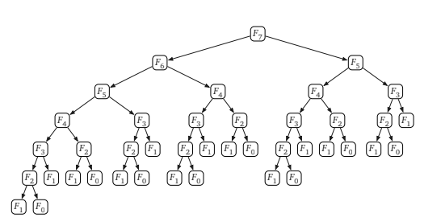

# Dynamic Programming

## What is Dynamic Programming?

***In the word of Computer Science:***

    A method for solving complex problems by splitting into collection smaller sub-problems and solving each of the sub-problems only once and store their values.

In other word, we can say it's the combination of recursion but not doing the same sub-problems more than once by remembering the result of the sub-problem and storing it in an array or object. When the same recursion function called again we can just look up the existing array or object and return the values.

## When can we choose Dynamic Programming?

We can use dynamic programming when we see the pattern of:
    - Optimal Substructure
    - Overlapping Subproblem

The best example for this is fibonacci series. Because for solving it we can convert the problem into multiple sub-problems and by solving each problem we can get to the solution:

For solving fib(5):

                                       Fib(5)
                     Fib(4)              +           Fib(3)
            Fib(3)     +     Fib(2)             Fib(2) + Fib(1)   
        Fib(2) + Fib(1)  Fib(1) + Fib(1)   Fib(1) + Fib(1)
    Fib(1) + Fib(1)

If you see that, this falls into Optimal Substructure and Overlapping Subproblem category. Because, to solve this we have to split the problems into N number of sub-problems and if we take a closer look this has Overlapping Subproblem as well like <code>Fib(3), Fib(2), Fib(1)</code>

 
source: https://muthu.co/fast-nth-fibonacci-number-algorithm/

## Strategies to Achieve the Dynamic:
There are two ways you can achieve:
    - Memoization
    - Tabulation

### Memoization:
    In Memoization, we will set an Array or Object(HashSet) Data Structure to store the previously computed sub-problem values and when the same problem arrives we can take the values from this store and return.

### Tabulation:
    In Tabulation, you will fill the initial values in an Table(Array) Data Structure and compute the next values based on the values stored in the table. Once you got the result, store it in the table again so that the next time we can use the previous values stored in the table and no need for additional calculation.

If you want to see both in action please look into <code>dynamic_programming_fibonacci_exercise.js</code>

## Difference Between Memoization and Tabulation:

<table style="width:100%">
    <thead>
        <tr style="width:100%;font-weight:bold;">
            <td>Memoization</td>
            <td>Tabulation</td>
        </tr>
    </thead>
    <tbody>
        <tr style="width:100%">
            <td>Mostly used in recursion</td>
            <td>Used in linear calculation problems</td>
        </tr>
        <tr style="width:100%">
            <td>Top Down Approach</td>
            <td>Bottom up Approach</td>
        </tr>
        <tr>
            <td>
                Since it's used in recursion at one point we will reach call-stack exceeded issue.
            </td>
            <td>
                Since it's linear the call-stack issue never arise. 
            </td>
        </tr>
    </tbody>
</table>

## Time Complexity

If we take fibonacci as an example:

Without Dynamic Programming:
    
    O(2^n)

    In simple words it's way larger than O(n^2)

With Dynamic Programming:
    
    O(n)

    Since every subproblem should be solved once it will take only linear time to solve the problem.

### More to read

[Memoization vs Tabulation] (https://medium.com/@aryan.jain19/memoization-vs-tabulation-in-dp-4ff137da8044)
