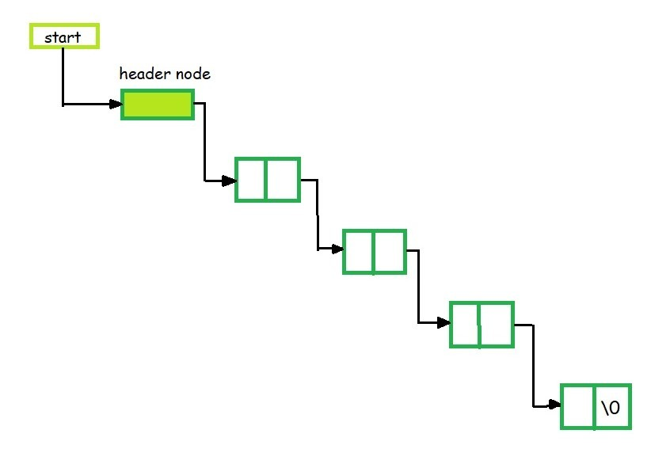
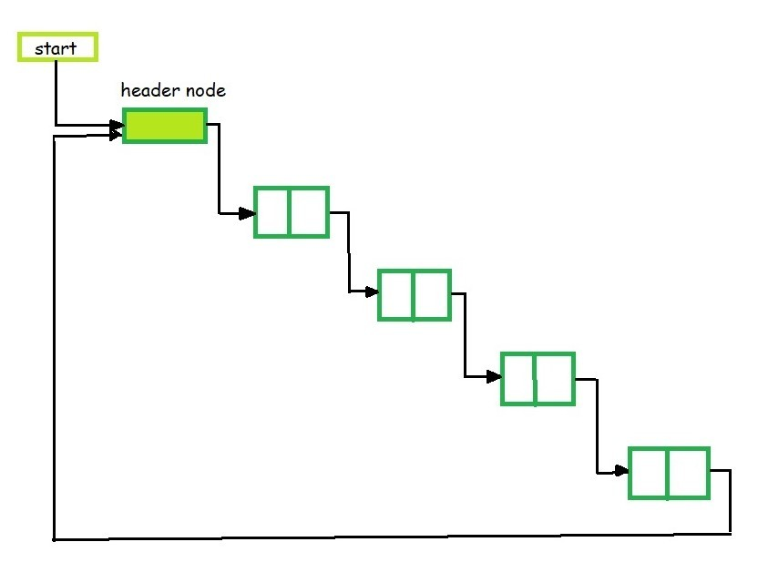

# Linked List

> A ***linked list*** is a linear data structure, in which the elements are not stored at contiguous memory locations.

Another way of saying this

> *Linked List is a linear data structure, in which elements are not stored at a contiguous location, rather they are linked using pointers. Linked List forms a series of connected nodes, where each node stores the data and the address of the next node.*


<br/>
Data will be stored in NODE. Each node will represent 2 fields.
<br/><br/>

**data:** Stores the data

**next:** Pointer to the next node

**Head and Tail:** The linked list is accessed through the ***head node, which points to the first node in the list***. The ***last node in the list points to NULL or nullptr***, indicating the end of the list. This node is known as the tail node.

## Types of Linked-List:
1. Single-linked list
    - Each node contains reference to the next node in the sequence.
    - Only forward traversal is possible since we don't have access to the previous node reference at any node.
    

    Head - First Node <br/>
    Last Node Next Reference - NULL <br/>

2. Double linked list
    - Each node contains info about next and previous node.
    - Both forward and backward traversal is possible since each node contains information about both previous and next node.
    

    **Head** - First Node <br/>
    **First Node Previous Reference** - NULL <br/>
    **Last Node Next Reference** - NULL <br/>

3. Circular linked list
    - Last Nodes reference set as first node instead of NULL making it into the circular form.
    - Can be created with Single & Doubly linked list.
    

    **Head** - First Node <br/>
    **Last Node Next Reference** - First Node <br/>

4. Header linked list
    - The header node is a special node positioned at the beginning of the list.
    - This node will be useful for storing information that is needed for other nodes at any point of time. Ex: We can store the length info here. So, when length is asked we can get it back from here.

    **Grounded Header Linked List:**
    - Last Node reference is NULL make it as a Grounded Header Linked List
    

    **Circular Header Linked List:**
    - Last Node reference to header node make it as a Grounded Header Linked List
    
    
**Basic Operations On Linked List:**

**Insertion:**
- Insert at beginning, end or at any index passed

**Deletion:**
- Delete at beginning, end or at any index passed

**Search:**
- Search any element by traversing the linked list
- Search any index also need traversal since it's not working like an array

## Advantages of Linked List:

**Dynamic Data structure:** The size of memory can be allocated or de-allocated at run time based on the operation insertion or deletion.

**Ease of Insertion/Deletion:** The insertion and deletion of elements are simpler than arrays since no elements need to be shifted after insertion and deletion, Just the address needed to be updated.

**Efficient Memory Utilization:** As we know Linked List is a dynamic data structure the size increases or decreases as per the requirement so this avoids the wastage of memory. 

**Implementation:** Various advanced data structures can be implemented using a linked list like a stack, queue, graph, hash maps, etc.

```
Example: 

In a system, if we maintain a sorted list of IDs in an array id[] = [1000, 1010, 1050, 2000, 2040]. 

If we want to insert a new ID 1005, then to maintain the sorted order, we have to move all the elements after 1000 (excluding 1000). 

Deletion is also expensive with arrays until unless some special techniques are used. For example, to delete 1010 in id[], everything after 1010 has to be moved due to this so much work is being done which affects the efficiency of the code.

```

## Disadvantages of Linked Lists:

**Random Access:** Unlike arrays, linked lists do not allow direct access to elements by index. Traversal is required to reach a specific node.

**Extra Memory:** Linked lists require additional memory for storing the pointers, compared to arrays.

### Sources:
1. [Linked-List-Geek-For-Geeks] (https://www.geeksforgeeks.org/data-structures/linked-list/)

