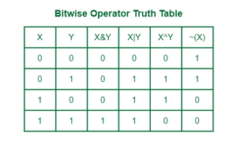
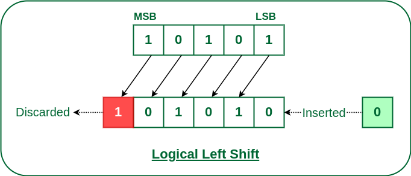
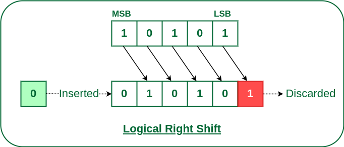

# Bitwise Operator

    Bit represent only binary value 0 or 1. We normally use decimal numbers between 0 to 9. Unlike humans computers don't have any concept of numbers and strings. They get encoded data as 0's and 1's format. The O and 1 are represent a bit.

    Bitwise algorithm is used to perform operations at different level or to manipulate bits in different ways. The bitwise operations are pretty fast compared to all the other operations so it's used for performance improvement on program.

    For example, If you wanted to check whether the number is odd or even you can simply check whether the last bit of the number is zero or not. If zero then it's even else odd.

    n & 1 === 0 (even) or 1 (odd)

## Bit Manipulation

    To manipulate bits involves manipulation of bits at bit level(bitwise). Bit manipulation are performed by using basic bit operations. These are all really fast and efficient. Using them will make our program much faster. Using them will reduce the time complexity of the program.

    These bit manipulation are performed in ALU(Arithmetic and Logical Unit) which is part of CPU.

## Bit Operations

- AND
- OR
- XOR
- NOT
- Left Shift
- Right Shift

### Bitwise AND (&)

If two bit's are equal it'll be true(1) else false(0).

1 & 1 => 1 
0 & 1 (or) 1 & 0 (or) 0 & 0 => 0

### Bitwise OR (|)

If single bit is true(1) then the final value will be true.

0 | 1 (or) 1 | 0 (or) 1 | 1 => 1
0 | 0 => 0

### Bitwise XOR (^)

XOR means Exclusive OR in bitwise operation. When the corresponding bits are both different then this will return 1 else 0.

0 ^ 1 (or) 1 ^ 0 => 1
0 ^ 0 (or) 1 ^ 1 => 0

### Bitwise NOT (~)

Unlike others Bitwise NOT will work with only one bit. It will take a bit and return it's compliment.

~ 0 = 1
~ 1 = 0

### Left Shift (<<)

Left shift makes the bits to be moved to left by number that is specified after << . Usually it denotes as <<k . Where K denotes number of bits that needs to be moved left.

On each time if you shift a number using left shift it doubles the number.

2 << 1 = 4
2 << 2 = 8
2 << 3 = 16
2 << 4 = 32

### Right Shift (>>)

The right shift operator denotes with >>. The right shift moves the number of bits to right side with the specified number after the expression.  >> k

Every time if we move the number with right shift it will be divided by 2.

32 >> 1 = 16
32 >> 2 = 8
32 >> 3 = 4
32 >> 4 = 2

